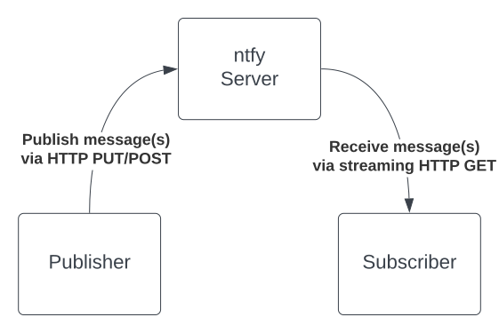
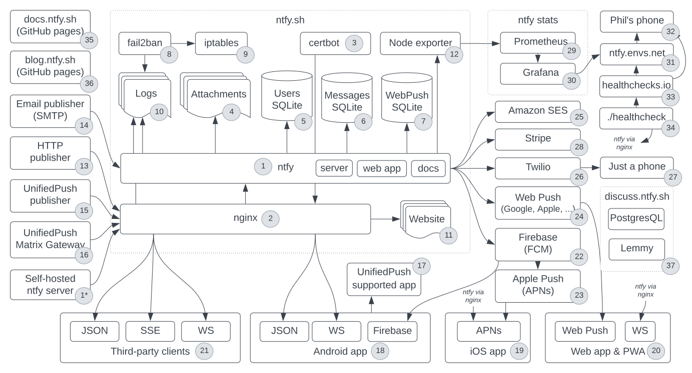
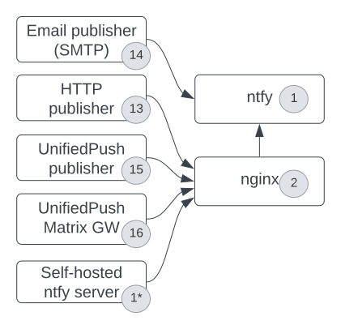
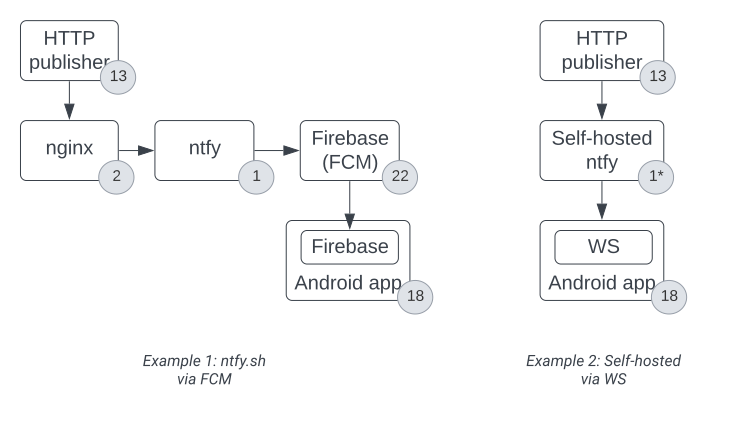
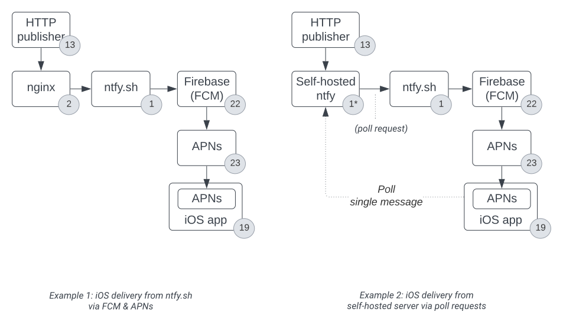
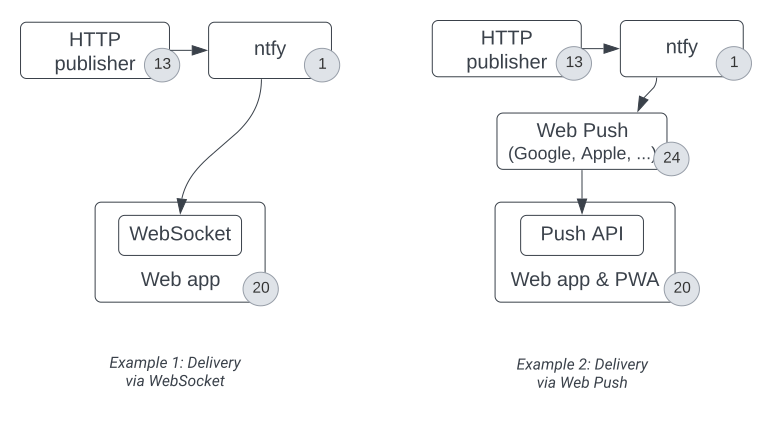
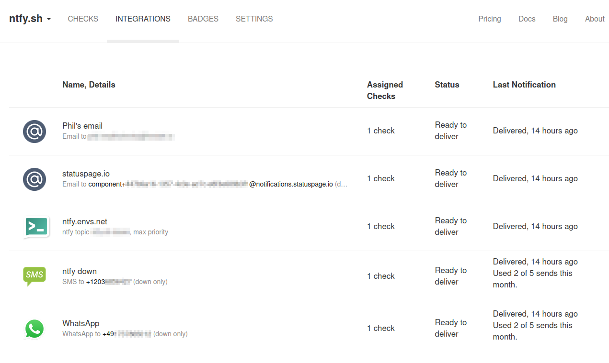

# 138 lines of code
Just over two years ago, I committed the first [138 lines](https://github.com/binwiederhier/ntfy/blob/e79b50f0106ae3b515dcb26485504f42952dedf1/main.go) of Go code to the ntfy repository. A lot has changed since then: a lot more code, a lot more features, an [iOS app](https://apps.apple.com/us/app/ntfy/id1625396347), an [Android app](https://play.google.com/store/apps/details?id=io.heckel.ntfy), a [PWA](https://docs.ntfy.sh/subscribe/pwa/), countless [integrations](https://docs.ntfy.sh/integrations/) into all sorts of tools, and lots of tutorials and videos from ntfy fans. Crazy!

But even though it looks as though everything changed, the basic idea behind ntfy's HTTP-based publish-subscribe mechanism remains the same as those original 138 lines of code.

In this blog post, in honor of your birthday, little ntfy-toddler, I'd like to show you all a little bit **how ntfy is architected**, and how its infrastructure is set up. I hope you'll enjoy it.

<!-- more -->

## Publish-subscribe
Let's start by doing a little deep dive into those [138 lines of code](https://github.com/binwiederhier/ntfy/blob/e79b50f0106ae3b515dcb26485504f42952dedf1/main.go). If you're only interested in the architecture and infrastructure, you may want to [skip this section](#current-architecture).

Even though the original code didn't have an Android/iOS app, it was still able to deliver on the core idea of ntfy: publishing a message via HTTP PUT, and receiving it via HTTP GET to all its subscribers.

<figure markdown>
  { width="500" }
  <figcaption>Publish-subscribe is the core idea of ntfy</figcaption>
</figure>

It's actually quite remarkable how similar those few lines are to what the code looks like today -- even two years later. I thought it'd be fun to check out the code and run it, so here it goes.

If you check out the initial commit, and run the code, you'll see something like this: 

```shell
git clone https://github.com/binwiederhier/ntfy
git checkout e79b50f0106ae3b515dcb26485504f42952dedf1
go run main.go
```

Not much to look at, but this will start an HTTP server on port 9997 and listen for incoming HTTP connections. You can subscribe to topics via GET (e.g. `curl localhost:9997/mytopic`), and you can publish via PUT (e.g. `curl -X PUT -d "Hi there" localhost:9997/mytopic`), just like you can today with ntfy.sh or your self-hosted server.

The code defines two handlers: one for [publishing messages](https://github.com/binwiederhier/ntfy/blob/e79b50f0106ae3b515dcb26485504f42952dedf1/main.go#L104) (HTTP PUT), and one for [receiving/subscribing](https://github.com/binwiederhier/ntfy/blob/e79b50f0106ae3b515dcb26485504f42952dedf1/main.go#L75) (HTTP GET).

When the [GET handler is called](https://github.com/binwiederhier/ntfy/blob/e79b50f0106ae3b515dcb26485504f42952dedf1/main.go#L64-L67) (e.g. via `curl` or Postman), the code dynamically creates a topic (the code still calls this a [`Channel`](https://github.com/binwiederhier/ntfy/blob/e79b50f0106ae3b515dcb26485504f42952dedf1/main.go#L20)). Each topic contains a list of `listeners` (aka subscribers), which are just functions that write JSON to the HTTP response one line at a time.

Once the listener is [added to the topic](https://github.com/binwiederhier/ntfy/blob/e79b50f0106ae3b515dcb26485504f42952dedf1/main.go#L86), the subscriber [blocks and does nothing](https://github.com/binwiederhier/ntfy/blob/e79b50f0106ae3b515dcb26485504f42952dedf1/main.go#L89-L92). Most importantly, it doesn't close the HTTP request, but instead just keeps the request open by not exiting the function -- identical to how long polling or [server-sent events (SSE)](https://en.wikipedia.org/wiki/Server-sent_events) works.

This is what allows ntfy to connect a publisher (HTTP PUT) to a subscriber: When a new message is published, the [code finds the correct topic](https://github.com/binwiederhier/ntfy/blob/e79b50f0106ae3b515dcb26485504f42952dedf1/main.go#L125) and simply [writes to all subscribers](https://github.com/binwiederhier/ntfy/blob/e79b50f0106ae3b515dcb26485504f42952dedf1/main.go#L113-L118) with that message. Since their sockets are still open, we can just write to them directly.

That's pretty much it. In its very basic form, this is still what ntfy does today, and **you can still publish/subscribe like that using this exact same API**.

## Current architecture
But of course, a lot has changed since these first 138 lines of code. I've added tons of features and many components. So let's look at what the architecture diagram looks like today.

<figure markdown>
  [](../static/img/1-ntfy-architecture.svg)
  <figcaption>ntfy architecture, as of 11/23</figcaption>
</figure>

**Holy macaroni!** That certainly looks a lot more complicated than the original diagram. And frankly, I didn't really expect a diagram with this many boxes when I started drawing it. But let's go through it step by step.

<style>
.bubble {
  border-radius: 50%;
  width: 21px;
  line-height: 21px;
  padding: 0;
  background: #eee;
  border: 1px solid #ccc;
  font-size: 0.7em;
  display: inline-block;
  text-align: center;
}
</style>

### ntfy.sh server
In the center of the picture, you'll see the ntfy.sh server. As of today, ntfy.sh runs on a **single Ubuntu-based server** with 8 vCPUs and 16 GB of RAM on [DigitalOcean](https://m.do.co/c/442b929528db) (_referral link_). 

On paper, the reliability guarantees of a single-server setup are obviously not be perfect, but in reality, **this one server has worked surprisingly well**. ntfy.sh handles tens of thousands of connected clients,  millions of requests per day, and close to a million legitimate notifications per day, and yet that little Droplet holds up just fine. Yes, there have been a handful of (mostly) short, and self-inflicted [outages](https://ntfy.statuspage.io/), and upgrades are a little challenging due to the [thundering herd problem](https://en.wikipedia.org/wiki/Thundering_herd_problem) -- but overall, it's been rock solid. I do have plans to introduce a more resilient multi-node setup in the near future, but nothing concrete yet.

This server, the one to rule them all, is deployed via an [Ansible playbook](https://github.com/binwiederhier/ntfy-ansible). As part of that playbook, the ntfy binary <span class="bubble">1</span> is deployed as a Debian package, and runs as a [systemd](https://en.wikipedia.org/wiki/Systemd) service. The binary is an all-in-one binary: it serves the ntfy server itself (publishing, subscribing, ...), the [ntfy docs](https://ntfy.sh/docs), as well as the [React](https://react.dev/)-based [web app](https://ntfy.sh/app). All of these are baked into the binary itself, so no external resources are required. You may want to check out how the [server.yml](https://github.com/binwiederhier/ntfy-ansible/blob/main/roles/ntfy/templates/server.yml.j2) on ntfy.sh is configured, to give you a better idea of the setup.

Incoming HTTP/HTTPS-based traffic goes through [nginx](http://nginx.org/) <span class="bubble">2</span> and is proxied to the ntfy server via a Unix socket. This is mainly because nginx allows hot-reloading TLS certs, which we do via [certbot](https://certbot.eff.org/) <span class="bubble">3</span>. nginx has worked really well for me, even though the config is a little awkward, and it feels a bit dated. Though as you may or may not know, **[boring can be good](https://boringtechnology.club/)**, so I'm fine with that.

As you can imagine, ntfy.sh is configured to use all of ntfy's features, so we have a dedicated folder for [attachments](https://docs.ntfy.sh/config/#attachments) <span class="bubble">4</span>, as well as three [SQLite](https://www.sqlite.org/) databases: one for [user and access management](https://docs.ntfy.sh/config/#access-control) <span class="bubble">5</span>, one for the [message cache](https://docs.ntfy.sh/config/#message-cache) <span class="bubble">6</span>, and one to keep track of [Web Push](https://docs.ntfy.sh/config/#web-push) subscriptions <span class="bubble">7</span>. 

**SQLite is awesome!** Despite the significant traffic, it's been quite performant, resilient, and has not been a bottleneck -- well, at least since I added an in-memory queue and batch-based writes (see [GitHub](https://github.com/binwiederhier/ntfy/issues/498)  [issues](https://github.com/binwiederhier/ntfy/pull/502)).

To keep bad actors in check, ntfy is configured with strict [rate limits](https://docs.ntfy.sh/config/#rate-limiting) (messages per day, number of subscriptions, ...), and additionally uses [fail2ban](https://github.com/fail2ban/fail2ban) <span class="bubble">8</span> to ban misbehaving IP addresses via [iptables](https://en.wikipedia.org/wiki/Iptables) <span class="bubble">9</span>. This is done by parsing the nginx logs <span class="bubble">10</span>, and then jailing IPs for a certain amount of time by dropping all packets. Even though fail2ban sometimes has a bad reputation, and it can be easily misconfigured to use too much CPU, it has been working great for ntfy.sh by helping to stop spammers and bad actors before they can cause too much damage. You can see how exactly fail2ban is configured in the [Ansible playbook](https://github.com/binwiederhier/ntfy-ansible/tree/main/roles/fail2ban).

Aside from the ntfy application, the ntfy.sh server also houses the ntfy.sh website <span class="bubble">11</span>. The website itself is one of the few pieces in the ntfy universe that's not open source, since it is uses paid website template. The site uses React and [Tailwind CSS](https://tailwindcss.com/), and is based on the [Pocket template](https://tailwindui.com/templates/pocket). It is deployed via GitHub Actions and rsync'd after every Git push to a certain branch.

The only other thing on the ntfy.sh server is the [Node exporter](https://github.com/prometheus/node_exporter) <span class="bubble">12</span>, a [Prometheus](https://prometheus.io/) exporter for hardware and OS metrics. This is part of the ntfy monitoring stack, which I'll discuss in more detail [in a section below](#monitoring-stack).

### Publishing notifications
The purpose of ntfy is to publish and receive notifications, so let's look at how we can publish messages (left side of the diagram).

<figure markdown>
  
  <figcaption>ntfy publishers</figcaption>
</figure>

The main way that notifications are published is via the [HTTP-based publishing API](https://docs.ntfy.sh/publish/) <span class="bubble">13</span>. Messages can be published via PUT/POST, including all the bells and whistles that ntfy supports ([title](https://docs.ntfy.sh/publish/#message-title), [priorities](https://ntfy.sh/docs/publish/#message-priority), [attachments](https://docs.ntfy.sh/publish/#attachments), ...). This is what most people use to publish messages. Just plain and simple HTTP (see [source code](https://github.com/binwiederhier/ntfy/blob/518505fa9d5d7c330e45feab542b57576f6c010d/server/server.go#L836)), similar to what was already supported in the [original 138 lines of code](#publish-subscribe). 

Aside from the "normal way", it is also possible to [publish messages by sending an email](https://docs.ntfy.sh/publish/#e-mail-publishing) to `ntfy-$topic@ntfy.sh` <span class="bubble">14</span>. Incoming emails are translated to messages by parsing the email subject and body. That works because ntfy ships with a tiny [SMTP server](https://github.com/binwiederhier/ntfy/blob/main/server/smtp_server.go#L229), and because DNS is configured with an [MX record](https://en.wikipedia.org/wiki/MX_record) to allow email to be routed our way. This is a very neat feature that integrates with systems that do not speak HTTP (old routers, ...). To my surprise, I have had zero spam issues on the server, most likely because ntfy topics are password-like anyway, and because the email address has to be prefixed with `ntfy-`.

ntfy also implements [UnifiedPush](https://unifiedpush.org), a standard that provides an alternative way of delivering messages from application servers to Android apps. For UnifiedPush, the ntfy server can serve as a [push server](https://unifiedpush.org/spec/definitions/#push-server) <span class="bubble">15</span>, and as a [Matrix Push Gateway](https://unifiedpush.org/users/gateway/) <span class="bubble">16</span>. When acting as a push server, it pretty much does what ntfy does normally, except that topics are suffixed with `?up=1`, and can be discovered vai a `GET` request (e.g. [ntfy.sh/uptopic?up=1](https://ntfy.sh/uptopic?up=1)). When acting as a Matrix Push Gateway, ntfy translates Matrix push messages to UnifiedPush-compatible format. It implements a subset of the [Matrix Push Gateway specification](https://spec.matrix.org/v1.8/push-gateway-api/).

The self-hosted ntfy server <span class="bubble">1*</span> in this picture is part of the [iOS integration](#ios-app) and will be described below.

### Subscribing to topics
To subscribe to topics, and receive notifications, you can use the [Android app](https://play.google.com/store/apps/details?id=io.heckel.ntfy) <span class="bubble">18</span>, the [iOS app](https://apps.apple.com/us/app/ntfy/id1625396347) <span class="bubble">19</span>, the [Web app](https://ntfy.sh/app) <span class="bubble">20</span>, the [Progressive Web App](https://docs.ntfy.sh/subscribe/pwa/) (also <span class="bubble">20</span>), any [other third party app](https://docs.ntfy.sh/integrations/) <span class="bubble">21</span>, or you can write your own. 

Lots of choices, but many of the underlying protocols for these apps are the same. The [ntfy subscribe API](https://docs.ntfy.sh/subscribe/api/) exposes a HTTP-based long-polling interface that can be used by any HTTP-capable clients. As of today, ntfy supports [JSON streaming](https://en.wikipedia.org/wiki/JSON_streaming) (one JSON message per line), [Server-Sent Events](https://developer.mozilla.org/en-US/docs/Web/API/Server-sent_events) (SSE), [WebSocket](https://en.wikipedia.org/wiki/WebSocket) (WS), [Firebase Cloud Messaging](https://firebase.google.com/docs/cloud-messaging) (FCM), [Web Push](https://web.dev/articles/push-notifications-web-push-protocol), and [HTTP/JSON-based polling](https://docs.ntfy.sh/subscribe/api/#poll-for-messages).

Third party apps can pick between any of the well-documented APIs: JSON stream, SSE, or WebSocket. All three are incredibly straight forward to use and very compatible.

#### Android app
One of the most common ways to subscribe to topics is the ntfy Android app (<span class="bubble">18</span>, [source code](https://github.com/binwiederhier/ntfy-android)). It comes in two flavors: In the [Google Play flavor](https://play.google.com/store/apps/details?id=io.heckel.ntfy), the app uses Firebase Cloud Messaging (FCM) for all topic subscriptions on ntfy.sh, and additionally JSON stream or WebSocket if [instant delivery](https://docs.ntfy.sh/subscribe/phone/#instant-delivery) is enabled. For all non-ntfy.sh subscriptions, and for the [F-Droid flavor of the app](https://f-droid.org/en/packages/io.heckel.ntfy/), only JSON stream and WebSocket are used. 

<figure markdown>
  
</figure>

I realize that this is confusing. So let's try to make it clearer by working through two examples:

* **Example 1:** You are subscribed to `ntfy.sh/mytopic` in the Google Play flavor of the Android app, no instant delivery. In this case, Firebase is used to deliver the message: When you publish a notification (e.g. via HTTP POST, see <span class="bubble">13</span>), nginx accepts the message <span class="bubble">2</span> and passes it to the ntfy server <span class="bubble">1</span>. The message is then forwarded to Firebase <span class="bubble">22</span>, and finally delivered to the Android app <span class="bubble">18</span>. In this case, Google delivers the message to the phone.
* **Example 2:** You are subscribed to `ntfy.yourserver.de/mytopic`, a topic on a self-hosted ntfy server. In this case, Firebase is not used: When you publish a message <span class="bubble">13</span>, ntfy on your self-hosted server <span class="bubble">1\*</span> accepts the message, and then passes it on to all active subscribers, e.g. via WebSocket or JSON stream. In this case, the Android app <span class="bubble">18</span> keeps an active connection to the ntfy server, and the message is delivered directly.

Note that these are just examples. If you instant delivery with ntfy.sh, for instance, messages are also delivered via WebSocket or JSON stream. And if you use the F-Droid flavor of the app, Firebase is not used at all.

In my experience, Firebase has been both a blessing and a curse: It's dead simple to use, it's free (even for millions of messages a day!), requires no additional background service, and therefore has no battery penalty. On the flip side, that means that Google sees all the messages, and sadly message delivery times are also not that great. Especially when the phone is not being used, or in power-saving mode, messages may be delayed many minutes. Overall though, I'm pretty happy with FCM.

In general, the Android app is pretty dope (_if I may say so, hehe_). It is feature rich and rock solid, and has been working wonderfully. And people seem to like it.

#### iOS app
Contrary to the Android app, the [ntfy iOS app](https://apps.apple.com/us/app/ntfy/id1625396347) (<span class="bubble">19</span>, [source code](https://github.com/binwiederhier/ntfy-ios)) has been **quite the tragedy** from the very start. I made it because no other open source push notification service had an iOS app at all (_I believe this is still true_), and because I thought it'd be fun. I even borrowed an old iPhone 7 (thanks Marcus!), and I bought a used MacBook just to develop it.

And while it was a challenge to learn a new ecosystem (macOS, iOS, Swift, Swift UI, ...), and I fought a lot with things that are probably trivial to others (most notably, the MacBook keyboard), it was still fun to start from scratch and learn all these new things. 

The result is a **very bare-bones iOS app**: Compared to the Android app, it has a very limited amount of features (no attachments, display names, custom sounds, DND overrides, ...), and is quite frankly [really buggy](https://github.com/binwiederhier/ntfy/issues?q=is%3Aissue+is%3Aopen+label%3A%22%F0%9F%AA%B2+bug%22+label%3Aios). On top of that, the [self-hosting setup is quite awkward](https://ntfy.sh/docs/config/#ios-instant-notifications), and even requires ntfy.sh to help with instant notification delivery. It's weird, but ... it's better than nothing! 

Now let's focus on the technical details: Since iOS does not allow background processes, WebSocket or JSON stream cannot be used. Instead, Apple requires that all iOS push notifications go through the [Apple Push Notification service](https://developer.apple.com/documentation/usernotifications/setting_up_a_remote_notification_server/sending_notification_requests_to_apns) (APNs) <span class="bubble">23</span>. APNs is similar to Google's FCM (and actually integrates really well with it), except that due to the "no background processes" restriction, it makes it the only option on iOS. It's crazy, but iOS doesn't even allow regular background polling of any kind. That means that **every push notification has to go through APNs, no exceptions!** While this may be alright for a central service (e.g. ntfy.sh), it makes things quite tricky for self-hosted ntfy servers.

<figure markdown>
  
</figure>

Let's look at the same examples as above, but this time with the iOS app:

* **Example 1:** You are subscribed to `ntfy.sh/mytopic` in the iOS app: When you publish a notification <span class="bubble">13</span>, nginx accepts the message <span class="bubble">2</span> and passes it to the ntfy server <span class="bubble">1</span>. The message is then forwarded to FCM <span class="bubble">22</span>, which forwards it to APNs <span class="bubble">23</span>, which delivers it to the iOS app <span class="bubble">19</span>. A lot of hops, but it works well.
* **Example 2:** You are subscribed to `ntfy.yourserver.de/mytopic`, a topic on a self-hosted ntfy server: When you publish a message <span class="bubble">13</span>, ntfy on your self-hosted server <span class="bubble">1\*</span> accepts the message, and then passes a "poll request" to ntfy.sh (<span class="bubble">1</span>), which forwards that poll request to FCM <span class="bubble">22</span>, then APNs <span class="bubble">23</span>, and the iOS device <span class="bubble">19</span>. The iOS device then asks the self-hosted server <span class="bubble">1\*</span> for the message contents, and finally displays the message (for more details, see [ntfy docs](https://ntfy.sh/docs/config/#ios-instant-notifications)).

As you can see, the self-hosted variant is a little convoluted, and sadly still couples push notifications to the central ntfy.sh server. There just isn't another way (that I know of).

#### Web app &amp; PWA
The ntfy web app <span class="bubble">20</span> is a React-based [single page application](https://en.wikipedia.org/wiki/Single-page_application) (SPA). Just like the Android and iOS app, it can be used to subscribe to topics and publish messages. To subscribe to topics, the web app uses WebSocket, or [Web Push](https://web.dev/articles/push-notifications-web-push-protocol) (in combination with the browsers' [Push API](https://developer.mozilla.org/en-US/docs/Web/API/Push_API)). 

The web app comes in two flavors: A single page web app, and a [Progressive Web App](https://developer.mozilla.org/en-US/docs/Web/Progressive_web_apps) (PWA). 

* **Web app:** A traditional web app that runs in your browser, like any other website. 
* **Progressive Web App (PWA):** The PWA lets you install the web app as a semi-native application on Windows, macOS, Linux, and even iOS and Android. To learn more and see some screenshots, check out the [PWA ntfy docs](https://docs.ntfy.sh/subscribe/pwa/).

<figure markdown>
  
</figure>

Let's look at the publishing/subscribe flows again:

* **Example 1 (WebSocket):** When WebSockets are used to subscribe to topics, the web app <span class="bubble">20</span> keeps an active connection to the ntfy server <span class="bubble">1</span> for every subscribed topic. When a message is published <span class="bubble">13</span> needs to be delivered to the web app, it is sent down via the WS connection.
* **Example 2 (Web Push):** When Web Push is used, the web app uses the Push API to connect to the browser manufacturer's push server <span class="bubble">24</span> (Google, Microsoft, Apple, Mozilla) to subscribe. When publishing a message, the ntfy server <span class="bubble">1</span> forwards messages to the push server <span class="bubble">24</span>, which then forwards it to the browser. The message payload is encrypted, so only the ntfy server and the browser an read its contents. The benefit of using the Push API is that notifications can be delivered in the background, when the web app is not even open.

By default, the web app uses WebSockets and the PWA uses Web Push. To enable Web Push, you can toggle "background notifications" in the settings.

Even though the web app looks pretty simple, a lot of brainpower went into managing the various technologies. I am quite proud of it. I think it looks quite slick, and works really well.

### Emails, calls, billing
After looking at the core ntfy features, let's briefly check out the other peripherals:

* **Email notifications:** ntfy supports forwarding [notifications to an email address](https://docs.ntfy.sh/publish/#e-mail-notifications) when the user supplies an `Email:` header in the HTTP PUT/POST request. ntfy.sh uses [Amazon Simple Email Service](https://aws.amazon.com/ses/) (SES) <span class="bubble">25</span> as an SMTP server, though when self-hosting, any SMTP server is supported. Even though this feature is available without signup, nobody has complained yet about any email spam. The reason for this is probably that it is heavily rate limited, and that the publishers IP address is listed in the email body itself. 

* **Phone calls:** You can use [ntfy to call a phone](https://docs.ntfy.sh/publish/#phone-calls) and read the message out loud using text-to-speech (_cool, right?_). When a message contains a `Call:` header, and the number has been previously verified, the ntfy server talks to (_ha!_) the [Twilio Voice API](https://www.twilio.com/docs/voice) <span class="bubble">26</span>, which then calls the phone <span class="bubble">27</span> and speaks the message. While this is a super cool feature, very few people seem to use it sadly. I certainly learned a lot when implementing this -- most importantly how much regulation exists around sending SMS messages, and how little regulation around calling phones ... which is the reason why ntfy doesn't support SMS. 

* **Payments:** _"Let's talk about billing and payments."_ That's how every good story begins, right? Let's keep this brief: ntfy supports associating users with [pre-defined tiers](https://docs.ntfy.sh/config/#tiers) (e.g. free tier, ntfy Pro tier, ...). To facilitate [payments](https://docs.ntfy.sh/config/#payments)  for ntfy Pro tiers, ntfy integrates with [Stripe](https://stripe.com) <span class="bubble">28</span> by implementing the [Stripe Checkout flow](https://stripe.com/docs/payments/checkout), and reacting to certain incoming [webhooks](https://stripe.com/docs/webhooks) keep the tier and payment status in sync. While payments and billing may be boring to some, **I am a huge Stripe fan**. I love their developer docs, and their [time travel feature](https://stripe.com/docs/billing/testing/test-clocks). (_Stripe is not a ntfy sponsor. I'm just a fan._) 

### Monitoring stack
ntfy's monitoring stack is pretty straight forward. 

On another [DigitalOcean](https://m.do.co/c/442b929528db) (_referral link_) Droplet, a [Prometheus](https://prometheus.io/) <span class="bubble">29</span> server regularly scrapes metrics from ntfy <span class="bubble">1</span> via the built-in `/metrics` endpoint (see [ntfy monitoring](https://docs.ntfy.sh/config/#monitoring)), as well as from the [Node exporter](https://github.com/prometheus/node_exporter) <span class="bubble">12</span> on the main server. The scraped data is then visualized via [Grafana](https://grafana.com/) dashboards <span class="bubble">30</span>: For the ntfy data, I use [this dashboard](https://raw.githubusercontent.com/binwiederhier/ntfy/main/examples/grafana-dashboard/ntfy-grafana.json), and for the Node exporter, I've found the [Node Exporter Full](https://grafana.com/grafana/dashboards/1860-node-exporter-full/) dashboard pretty nice. 

<figure markdown>
  
  <figcaption>ntfy Grafana dashboard</figcaption>
</figure>

I set a number of alerts in Grafana that will send me a notification via ntfy when something goes wrong. Obviously, since we're monitoring ntfy.sh, we can't also use ntfy.sh to send the alerts. Instead, we're using [ntfy.envs.net](https://ntfy.envs.net) <span class="bubble">31</span>, a ntfy server that is kindly provided to the public by [~creme](https://envs.net/~creme/). Alerts will then be delivered to my phone <span class="bubble">32</span> via the ntfy Android app. Example alerts include high load average, high RAM usage, too many open files, too many processes in runnable state, etc.

This stats server and the ntfy.sh server are on the same internal network, and the ntfy stats server isn't exposed to the public Internet at all. Instead, I'm using [Tailscale](https://tailscale.com/) as a VPN to connect the stats server and the Grafana dashboard. I've been a big fan of Tailscale since I discovered it. It's pretty magical and easy to set up, though lately I've struggled with high CPU consumption, which is a bit of a bummer. (_Tailscale is not a ntfy sponsor. I'm just a fan._) .

<figure markdown>
  
  <figcaption>ntfy healthchecks.io</figcaption>
</figure>

Another monitoring tool that I use is [healthchecks.io](https://healthchecks.io/) <span class="bubble">33</span>. It's originally meant as a [dead man's switch](https://en.wikipedia.org/wiki/Dead_man%27s_switch), but I'm using it slightly differently to monitor ntfy.sh: [Every 2 minutes](https://github.com/binwiederhier/ntfy-ansible/blob/a1e891c1ec0f4157a391b6049cee35f539894c99/roles/base/files/etc/cron.d/custom#L4), my laptop, my home server, and the ntfy.sh server itself run a simple [healthcheck script](https://github.com/binwiederhier/ntfy-ansible/blob/a1e891c1ec0f4157a391b6049cee35f539894c99/roles/base/files/usr/local/bin/ntfy-health-check) <span class="bubble">34</span>. This script publishes a ntfy message to [ntfy.sh/healthcheck](https://ntfy.sh/healthcheck), and then checks if the message was stored successfully on the ntfy.sh server.

If everything works, the script will ping healthchecks.io. However, if the ntfy.sh server cannot be reached, or the message could not be delivered or retrieved, the script will fail, and healthchecks.io will not be pinged. If there is no ping within a few minutes, healtchecks.io will notify me via email, as well as via a special topic on [ntfy.envs.net](https://ntfy.envs.net). On my phone, this topic is configured to **keep alerting and override Do Not Disturb  mode**, so the notification sound will ring until I acknowledge it. This is a pretty neat setup, and has helped me a few times already to catch issues early on.

### Docs, blog, and Lemmy
Almost done. Only three more things to talk about.

The [ntfy docs](https://docs.ntfy.sh) <span class="bubble">35</span> (source code), as well as [this blog](https://blog.ntfy.sh) <span class="bubble">36</span> are hosted on [GitHub pages](https://pages.github.com/). Both are using [MkDocs](https://www.mkdocs.org/) and [Material for MkDocs](https://squidfunk.github.io/mkdocs-material/) as the theme. **Material for MkDocs is such a fantastic theme, and I can't recommend it enough**. It's beautiful, responsive, and has tons of features.

The blog is deployed the normal GitHub pages way (build, git push, done), but the docs are a little different: Since the ntfy docs are included [in the main ntfy repo](https://github.com/binwiederhier/ntfy/tree/main/docs), but we want to host them on GitHub pages, they are built [via GitHub Actions](https://github.com/binwiederhier/ntfy/blob/main/.github/workflows/docs.yaml) in the main repo, and git-pushed to the [ntfy-docs.github.io repo](https://github.com/binwiederhier/ntfy-docs.github.io) and hosted by GitHub. This is a little awkward, but it works well, and it allows the docs to be included in the ntfy binary itself.

I also host a [Lemmy](https://lemmy.ml/) instance called [discuss.ntfy.sh](https://discuss.ntfy.sh) <span class="bubble">37</span>. Lemmy is a federated, open source alternative to Reddit. It's pretty neat, and I'm using it to discuss ntfy-related topics (though not so much lately). It's hosted on the tiniest [DigitalOcean](https://m.do.co/c/442b929528db) Droplet ever, and is deployed via the [lemmy-ansible](https://github.com/LemmyNet/lemmy-ansible) playbook. Because it's on such a tiny Droplet, it frequently runs out of memory and crashes, but at the moment, I'm not willing to invest more money to make it run well. I'm not even sure if I'll keep it around, since it's not really used much.

## Wrapping up
That's it! That's the ntfy architecture as of today. I hope you enjoyed this little tour. I certainly enjoyed writing it, though I must admit that it took me a lot longer than I expected. I hope it was worth it.

My original plan for this post included a section on the future architecture, or at least on my current thoughts around how I want to change things going forward. Given that this post is already way too long, I opted to talk about architectural changes in a follow-up post. So stay tuned, or reach out via [Discord](https://discord.gg/cT7ECsZj9w) or [Matrix](https://matrix.to/#/#ntfy:matrix.org).

Thanks for reading, and thanks for using ntfy!
