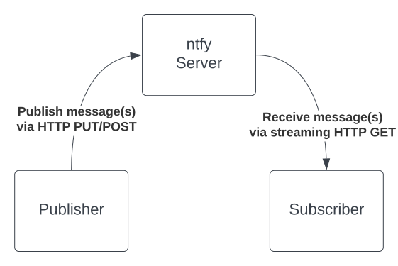

# 138 lines of code
Just over two years ago, I committed the first [138 lines](https://github.com/binwiederhier/ntfy/blob/e79b50f0106ae3b515dcb26485504f42952dedf1/main.go) of Go code to the ntfy repository. 
A lot has changed since then: a lot more code, a lot more features, an iOS app, an Android app, a PWA, and countless integrations into all sorts of tools. Crazy!

But even though it looks as though everything changed, the basic idea behind ntfy's HTTP-based publish-subscribe mechanism remains the same as those original 138 lines of code.

In this blog post, in honor of your birthday, little ntfy-toddler, I'd like to show you all a little bit how ntfy is architected, and how its infrastructure is set up.
I hope you'll enjoy it.

<!-- more -->

## Publish-subscribe
Even though the original code didn't have an Android/iOS app, it was still able to deliver on the core idea of ntfy: publishing a message via HTTP PUT, and receiving
it via HTTP GET to all its subscribers.

<figure markdown>
  { width="500" }
  <figcaption>Publish-subscribe is the core idea of ntfy</figcaption>
</figure>

It's actually quite remarkable how similar that 138 lines is to what it still is -- two years later. 
I thought it'd be fun to check out the code and run it, so here it goes.

If you check out the initial commit, and run the code, you'll see something like this: 

``` go
git clone https://github.com/binwiederhier/ntfy
git checkout e79b50f0106ae3b515dcb26485504f42952dedf1
go run main.go
2023/10/30 20:15:17 channels: 0
2023/10/30 20:15:22 channels: 0
2023/10/30 20:15:27 channels: 0
... 
```

This will start an HTTP server on port 9997 and listen for incoming HTTP connections. You can subscribe to topics via GET (e.g. `curl localhost:9997/mytopic`),
and you can publish via PUT (e.g. `curl -X PUT -d "Hi there" localhost:9997/mytopic`). 

The code defines two handlers: one for publishing messages ([HTTP PUT](https://github.com/binwiederhier/ntfy/blob/e79b50f0106ae3b515dcb26485504f42952dedf1/main.go#L104)),
and one for receiving/subscribing ([HTTP GET](https://github.com/binwiederhier/ntfy/blob/e79b50f0106ae3b515dcb26485504f42952dedf1/main.go#L75)).

When the GET handler is called (e.g. via `curl` or Postman), the code dynamically creates a topic (the code still calls this a `Channel`). Each
topic/channel which contains a list of `listeners` (aka subscribers). A listener is a function that writes to the HTTP response one line at a time (as JSON),
so that when a message comes in, it's written to the subscriber's HTTP response.

Once the listener is added to the topic, the subscriber blocks and does nothing. Most importantly, it doesn't close the HTTP request. It just keeps the HTTP GET
open by not exiting the function. This is what allows ntfy to connect a publisher (HTTP PUT) to a subscriber: When the new message is published, we find the
correct topic and simply write to all subscribers with that message. Since their sockets are still open, we can just write to them directly.

That's pretty much it. In its very basic form, this is still what ntfy does today, and you can still publish/subscribe like that using this exact same API.

## Architecture
A lot has changed since these first 138 lines of code. Of course, I've added tons of features 

## Infrastructure

lots of open files
fail2ban
nginx
open sockets
ansible
stats
sqlite

